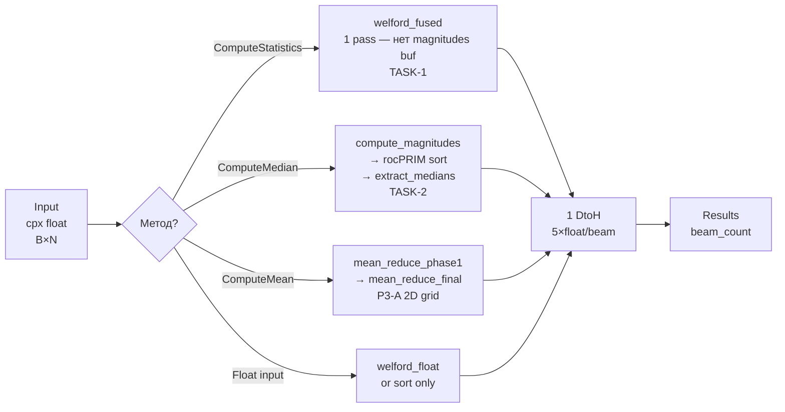

# Statistics — Полная документация

> Статистические вычисления на GPU: среднее, медиана, дисперсия, СКО для комплексных многолучевых сигналов

**Namespace**: `statistics`
**Каталог**: `stats/`
**Зависимости**: core (`IBackend*`, ROCm backend), rocPRIM (`segmented_radix_sort_keys`), hiprtc (JIT-компиляция ядер), `KernelCacheService` (disk HSACO cache)
**Платформа**: ROCm-only — `#if ENABLE_ROCM`. На Windows модуль полностью пропускается препроцессором.

---

## Содержание

1. [Обзор и назначение](#1-обзор-и-назначение)
2. [Зачем нужен / Алгоритм](#2-зачем-нужен)
3. [Математика алгоритма](#3-математика-алгоритма)
4. [Пошаговый pipeline](#4-пошаговый-pipeline)
5. [Kernels](#5-kernels)
6. [C4 Диаграммы](#6-c4-диаграммы)
7. [API (C++ и Python)](#7-api)
8. [Тесты](#8-тесты)
9. [Оптимизации](#9-оптимизации)
10. [Ссылки и файловое дерево](#10-ссылки)

**[Важные нюансы](#важные-нюансы)**

---

## 1. Обзор и назначение

`StatisticsProcessor` — ROCm-модуль для параллельных статистических вычислений над многолучевыми комплексными сигналами. Обрабатывает `beam_count` лучей по `n_point` сэмплов каждый за один GPU-вызов.

**Вход**: плоский вектор `complex<float>[beam_count × n_point]` (beam-major layout).

**Выход** — три типа результатов, каждый в виде вектора (по одному элементу на луч):

| Метод | Результат | Описание |
|-------|-----------|----------|
| `ComputeMean` | `MeanResult` | Комплексное среднее: Re + Im |
| `ComputeMedian` | `MedianResult` | Медиана модулей (radix sort + middle) |
| `ComputeStatistics` | `StatisticsResult` | mean(complex) + mean_mag + variance + std (one-pass Welford) |

Каждый метод доступен в двух перегрузках: CPU data (`vector<complex<float>>`) и GPU data (`void*` — уже на устройстве).

Дополнительно: `ComputeStatisticsFloat` / `ComputeMedianFloat` — работа с уже вычисленными модулями (`float*` input).

**Компиляция**:
- `statistics_processor.cpp` — g++ (хост, hiprtc JIT для welford/mean ядер)
- `statistics_sort_gpu.hip` — HIP/clang++ (rocPRIM `segmented_radix_sort_keys`)

---

## 2. Зачем нужен

### Проблема: статистика по множеству каналов

В задачах ЦОС на ФАР данные поступают сразу по нескольким лучам. Последовательное вычисление статистики на CPU для `beam_count` лучей — O(beam_count × n_point).

Для 256 лучей × 1.3M точек (из CMakeLists):
- CPU sort: ~2000 мс (последовательный `std::sort` per beam)
- GPU sort: ~30 мс (все лучи параллельно на RDNA4, 700 GB/s пропускная способность)

### Решение: GPU параллелизм по лучам

Один вызов `rocprim::segmented_radix_sort_keys` сортирует все лучи параллельно. `welford_fused` kernel вычисляет статистику всех лучей одновременно (один блок на луч).

### Связь с другими модулями

- **strategies/** использует `ComputeStatisticsFloat(gpu_float_ptr, params)` для пост-FFT статистики `|spectrum|` — float данные уже на GPU после FFTProcessor
- Результаты статистики могут использоваться для адаптивной обработки перед `HeterodyneDechirp`

---

## 3. Математика алгоритма

### ComputeMean — комплексное среднее

$$
\bar{z}_b = \frac{1}{N} \sum_{n=0}^{N-1} z_{b,n}, \quad z_{b,n} = x_{b,n} + j y_{b,n}
$$

Реализация: двухфазная иерархическая редукция с LDS + warp shuffle.

### ComputeStatistics — one-pass Welford (варинат E[X²] − E[X]²)

За один проход по данным луча `b`:

$$
S_1 = \sum_{n=0}^{N-1}|z_{b,n}|, \quad S_2 = \sum_{n=0}^{N-1}|z_{b,n}|^2
$$

$$
M_b = \frac{S_1}{N}, \quad M^{(2)}_b = \frac{S_2}{N}
$$

$$
\text{Var}_b = M^{(2)}_b - M_b^2 \quad (\text{clamp} \ge 0), \quad \text{STD}_b = \sqrt{\text{Var}_b}
$$

**Population variance** (ddof=0): делитель N, не N-1.

Одновременно накапливаются `sum_re`, `sum_im` для комплексного среднего.

**Ядро** `welford_fused` (TASK-1): вычисляет `|z|` на лету через `__fsqrt_rn(z.x*z.x + z.y*z.y)`, без отдельного промежуточного буфера модулей.

### ComputeMedian — radix sort + middle element

1. `compute_magnitudes`: `magnitudes[i] = |z[i]|` (float)
2. `rocprim::segmented_radix_sort_keys`: все лучи параллельно, ascending order
3. `extract_medians`: `median[b] = sorted[b*N + N/2]`

**Определение**: элемент с индексом `N/2` — **не** среднее двух средних для чётного N. NumPy эквивалент: `sorted_arr[len(sorted_arr) // 2]`, не `np.median()`.

---

## 4. Пошаговый pipeline

### ComputeStatistics (оптимальный путь — welford_fused)

```
INPUT: flat complex<float>[beam_count × n_point]
    │
    ▼ CPU path: UploadData → hipMemcpyHtoDAsync → input_buffer_
    │ GPU path: CopyGpuData → hipMemcpyDtoDAsync → input_buffer_
    │
    ▼
┌─────────────────────────────────────────────────────────┐
│ welford_fused kernel (TASK-1)                          │
│ Grid: (beam_count, 1, 1)   Block: (256, 1, 1)          │
│ Shared mem: 4 × (256+1) × sizeof(float) = P3-B padding │
│                                                         │
│ Per thread: for i in [tid..n_point) step 256 (#unroll4)│
│   z = input[beam*N + i]                                │
│   mag = __fsqrt_rn(z.x²+z.y²)                         │
│   sum_re += z.x,  sum_im += z.y                        │
│   sum_mag += mag, sum_sq += mag²                       │
│                                                         │
│ LDS tree reduce (256 → WARP_SIZE)                      │
│ Warp shuffle (WARP_SIZE → 1, no __syncthreads)         │
│ → WelfordResult{mean_re, mean_im, mean_mag, var, std}  │
└─────────────────────────────────────────────────────────┘
    │
    ▼ hipStreamSynchronize + hipMemcpyDtoH (5×float per beam)
    │
OUTPUT: StatisticsResult[beam_count]
```

### ComputeMedian (radix sort путь)

```
INPUT: flat complex<float>[beam_count × n_point]
    │
    ▼ UploadData / CopyGpuData → input_buffer_
    │
    ▼
┌─────────────────────────────────────────────────────────┐
│ compute_magnitudes kernel (P3-D double-load)           │
│ Grid: ceil(total/(256×2))   Block: 256                  │
│ Каждый поток обрабатывает 2 элемента:                   │
│   magnitudes[gid] = __fsqrt_rn(x²+y²)                  │
└─────────────────────────────────────────────────────────┘
    │
    ▼
┌─────────────────────────────────────────────────────────┐
│ rocprim::segmented_radix_sort_keys                      │
│ Все beam_count сегментов ПАРАЛЛЕЛЬНО                    │
│ offsets_buf: [0, N, 2N, ..., beam_count×N]             │
│ magnitudes → sort_buf (ascending float)                 │
└─────────────────────────────────────────────────────────┘
    │
    ▼
┌─────────────────────────────────────────────────────────┐
│ extract_medians kernel (TASK-2)                         │
│ Grid: ceil(beam_count/256)   Block: 256                 │
│ 1 поток на луч:                                         │
│   medians[b] = sort_buf[b*N + N/2]                      │
│ → medians_compact_buf[beam_count] floats               │
└─────────────────────────────────────────────────────────┘
    │
    ▼ hipMemcpyDtoH: 1 вызов (beam_count × 4 байта)
    │
OUTPUT: MedianResult[beam_count]
```

### ComputeMean (двухфазная редукция)

```
INPUT → UploadData/CopyGpuData → input_buffer_
    │
    ▼
┌─────────────────────────────────────────────────────────┐
│ mean_reduce_phase1 (P3-A: 2D grid)                     │
│ Grid: (blocks_per_beam, beam_count, 1)                  │
│ blockIdx.y = beam_id (нет div/mod!)                    │
│ Double-load: каждый поток читает 2 элемента             │
│ LDS +1 padding → tree reduce → warp shuffle            │
│ → partial_sums[beam_count × blocks_per_beam]           │
└─────────────────────────────────────────────────────────┘
    │
    ▼
┌─────────────────────────────────────────────────────────┐
│ mean_reduce_final                                       │
│ Grid: (beam_count, 1, 1)   Block: ≤256                  │
│ Суммирует partial_sums каждого луча                     │
│ Делит на n_point → float2_t[beam_count] (re, im)       │
└─────────────────────────────────────────────────────────┘
    │
    ▼ hipMemcpyDtoH
OUTPUT: MeanResult[beam_count]
```

### Mermaid диаграмма



---

## 5. Kernels

Все ядра (кроме rocPRIM) компилируются через **hiprtc** (JIT) из строки `statistics::kernels::GetStatisticsKernelSource()`.

**Параметры компиляции**: `-O3 -std=c++17 -DWARP_SIZE=N -DBLOCK_SIZE=256 [--offload-arch=gfxXXXX]`

**WARP_SIZE**: gfx9xx (CDNA/Vega) → 64; все прочие (RDNA) → 32. Определяется через `ROCmBackend::GetCore().GetArchName()`.

**Disk HSACO cache**: `KernelCacheService("stats/kernels", ROCm)`. Кеш описывается в `kernels/manifest.json`.

---

### Kernel 1: `compute_magnitudes`

**Назначение**: `magnitudes[i] = sqrt(z.x² + z.y²)` для каждого элемента.

| Параметр | Тип | Описание |
|----------|-----|----------|
| `input` | `const float2_t*` | Комплексные данные [total_elements] |
| `magnitudes` | `float*` | Модули [total_elements] |
| `total_elements` | `uint` | beam_count × n_point |

**Grid**: `(ceil(total / (blockDim.x * 2)), 1, 1)` — P3-D double-load.
**Используется только в**: ComputeMedian path. `ComputeStatistics` использует `welford_fused` напрямую.

```c
// P3-D: double-load — 2 элемента на поток
gid1 = blockIdx.x * blockDim.x * 2 + threadIdx.x
gid2 = gid1 + blockDim.x
magnitudes[gid1] = __fsqrt_rn(z1.x*z1.x + z1.y*z1.y)
magnitudes[gid2] = __fsqrt_rn(z2.x*z2.x + z2.y*z2.y)
```

---

### Kernel 2: `mean_reduce_phase1`

**Назначение**: блочная редукция Re и Im частей для каждого луча.

| Параметр | Тип | Описание |
|----------|-----|----------|
| `input` | `const float2_t*` | Комплексные данные |
| `partial_sums` | `float2_t*` | Частичные суммы [beam_count × blocks_per_beam] |
| `beam_count`, `n_point` | `uint` | Размеры |

**Grid**: `(blocks_per_beam, beam_count, 1)` — P3-A 2D grid (blockIdx.y = beam_id, eliminates div/mod).
**blocks_per_beam**: `ceil(n_point / (blockDim.x * 2))` — double-load!
**LDS**: `sdata_x[256+1]`, `sdata_y[256+1]` — P2-B +1 padding vs bank conflicts.

---

### Kernel 3: `mean_reduce_final`

**Назначение**: финальная редукция partial_sums → mean per beam.

| Параметр | Описание |
|----------|----------|
| `partial_sums` | вход от phase1 |
| `means` | выход: float2_t[beam_count] |
| `blocks_per_beam` | передаётся явно (P1-D — нет div в ядре) |

**Grid**: `(beam_count, 1, 1)`, один блок на луч. Делит на n_point → mean.

---

### Kernel 4: `welford_stats`

**Назначение**: compat-версия, читает `input + magnitudes`. Оставлена для обратной совместимости. В текущем `ComputeStatistics` не используется (заменена `welford_fused`).

---

### Kernel 5: `welford_fused` (TASK-1, основной)

**Назначение**: one-pass статистика без промежуточного magnitudes buffer.

| Параметр | Тип | Описание |
|----------|-----|----------|
| `input` | `const float2_t*` | Только комплексный вход |
| `results` | `WelfordResult*` | Результаты: 5 float per beam |
| `beam_count`, `n_point` | `uint` | Размеры |

**Grid**: `(beam_count, 1, 1)`, один блок на луч.
**Shared mem**: `4 × (kBlockSize + 1) × sizeof(float)` = P3-B LDS padding.

```c
// Структура WelfordResult (5 float):
struct WelfordResult {
    float mean_re, mean_im;   // комплексное среднее
    float mean_mag;            // среднее |z|
    float variance;            // Var(|z|) = E[|z|²] - E[|z|]²
    float std_dev;             // sqrt(variance)
};
```

**Финальная формула** (tid==0):
```c
inv_n = 1.0f / n_point
r.mean_re  = sum_re  * inv_n
r.mean_im  = sum_im  * inv_n
r.mean_mag = sum_mag * inv_n
mean_sq    = sum_sq  * inv_n
r.variance = max(mean_sq - r.mean_mag², 0)   // clamp ≥ 0
r.std_dev  = __fsqrt_rn(r.variance)
```

---

### Kernel 6: `extract_medians` (TASK-2)

**Назначение**: GPU-компактное извлечение медианы каждого луча.

| Параметр | Тип | Описание |
|----------|-----|----------|
| `sorted` | `const float*` | sort_buf после rocPRIM [beam_count × n_point] |
| `medians` | `float*` | Compact output [beam_count] |
| `n_point`, `beam_count` | `uint` | Размеры |

**Логика**: `medians[b] = sorted[b * n_point + n_point / 2]`
**Grid**: `(ceil(beam_count/256), 1, 1)`.
**Ключевое преимущество**: 1 DtoH вместо beam_count DtoH.

---

### Kernel 7: `welford_float`

**Назначение**: статистика для float input (модули уже вычислены).

Используется `strategies/` для пост-FFT анализа. `mean_re = mean_im = 0.0` в результате.
**Shared mem**: `2 × (kBlockSize + 1) × sizeof(float)` (только sum_mag + sum_sq).

---

### rocPRIM: segmented radix sort (`statistics_sort_gpu.hip`)

Компилируется HIP-компилятором (clang++), отдельный `.hip` файл.

```cpp
// Query temp size (вызывается при AllocateBuffers):
gpu_sort::QuerySortTempSize(temp_size, d_begin, d_end, total, num_segments, stream)

// Execute sort:
gpu_sort::ExecuteSort(temp_storage, temp_size, keys_in, keys_out,
                      d_begin, d_end, total_elements, num_segments, stream)
```

`rocprim::segmented_radix_sort_keys` — full 32-bit radix (0..31), ascending.
Offsets заполняются в `AllocateBuffers`: `offsets[b] = b * n_point`.

---

## 6. C4 Диаграммы

### C1 — Контекст системы

```
┌──────────────────────────────────────────────────────────┐
│  DSP-GPU — ЦОС-конвейер                               │
│                                                           │
│  ┌────────────────┐   complex[B×N]  ┌────────────────┐   │
│  │ Антенные       │ ──────────────► │ Statistics-    │   │
│  │ данные (CPU)   │                 │ Processor      │   │
│  └────────────────┘                 └───────┬────────┘   │
│                                             │             │
│  ┌────────────────┐   float[B×N]           │             │
│  │ FFTProcessor   │ ──────────────► StatisticsResult      │
│  │ (|spectrum|)   │                {mean,var,std,median}  │
│  └────────────────┘                                      │
└──────────────────────────────────────────────────────────┘
```

### C2 — Контейнеры

```
┌──────────────────────────────────────────────────────────────┐
│  stats/                                         │
│                                                               │
│  ┌──────────────────────────┐                               │
│  │  StatisticsProcessor     │ ← единственный публичный класс │
│  │  Namespace: statistics   │   нет фасада, нет интерфейса  │
│  └────────────┬─────────────┘                               │
│               │                                              │
│    ┌──────────┴──────────┐                                  │
│    │                     │                                  │
│  [hiprtc JIT kernels]  [rocPRIM segmented sort]             │
│  statistics_kernels_    statistics_sort_gpu.hip             │
│  rocm.hpp               (HIP compiler)                     │
│  (7 ядер)                                                   │
│                                                              │
│  Зависимости:                                               │
│  ├── core: IBackend*, ROCmBackend (GetNativeQueue)        │
│  ├── core: KernelCacheService (disk HSACO cache)          │
│  ├── core: ConsoleOutput                                  │
│  └── rocPRIM: roc::rocprim (header-only)                   │
└──────────────────────────────────────────────────────────────┘
```

### C3 — Компоненты

```
StatisticsProcessor
  ├── [Публичный API]
  │   ├── ComputeMean(data/gpu_data, params) → vector<MeanResult>
  │   ├── ComputeMedian(data/gpu_data, params) → vector<MedianResult>
  │   ├── ComputeStatistics(data/gpu_data, params) → vector<StatisticsResult>
  │   ├── ComputeStatisticsFloat(gpu_float_data, params) → vector<StatisticsResult>
  │   └── ComputeMedianFloat(gpu_float_data, params) → vector<MedianResult>
  │
  ├── [Ресурсы GPU — lazy init]
  │   ├── CompileKernels()       [TASK-3: hiprtc + HSACO disk cache]
  │   ├── AllocateBuffers()      [lazy resize при изменении beam/n_point]
  │   └── ReleaseResources()     [деструктор]
  │
  └── [GPU операции]
      ├── UploadData / CopyGpuData   [H2D / D2D async]
      ├── ExecuteMagnitudesKernel    [|z|, P3-D double-load]
      ├── ExecuteMeanReduction       [phase1 P3-A 2D grid + final]
      ├── ExecuteWelfordFusedKernel  [TASK-1: нет magnitudes buf]
      ├── ExecuteMedianSort          [rocPRIM segmented sort]
      ├── ExecuteExtractMediansKernel [TASK-2: GPU compact extract]
      └── ExecuteWelfordFloatKernel  [float input]
```

### C4 — Kernel welford_fused (уровень кода)

```
Thread block: beam_id = blockIdx.x ∈ [0, beam_count)
  tid = threadIdx.x ∈ [0, 255]
  base = beam_id × n_point
  │
  Shared memory (P3-B: +1 padding per array):
  s_sum_re[257], s_sum_im[257], s_sum_mag[257], s_sum_sq[257]
  │
  Grid-stride loop (P3-C: #pragma unroll 4):
  for i = tid; i < n_point; i += 256:
    z = input[base + i]
    mag = __fsqrt_rn(z.x*z.x + z.y*z.y)  [P2-A fast intrinsic]
    sum_re += z.x,  sum_im += z.y
    sum_mag += mag, sum_sq += mag*mag
  │
  LDS tree reduction (256 → WARP_SIZE через __syncthreads)
  │
  Warp shuffle (WARP_SIZE → 1, без __syncthreads, P1-A):
  for off = WARP_SIZE/2; off > 0; off >>= 1:
    vr += __shfl_down(vr, off)  ...
  │
  if tid == 0:
    results[beam_id] = {mean_re, mean_im, mean_mag, variance, std_dev}
```

---

## 7. API

### Структуры данных

```cpp
// Входные параметры
struct StatisticsParams {
    uint32_t beam_count = 1;    // число лучей
    uint32_t n_point    = 0;    // сэмплов на луч (complex float)
    size_t   memory_limit = 0;  // 0 = auto
};

// Результат ComputeMean
struct MeanResult {
    uint32_t beam_id = 0;
    std::complex<float> mean{0.0f, 0.0f};
};

// Результат ComputeStatistics
struct StatisticsResult {
    uint32_t beam_id = 0;
    std::complex<float> mean{0.0f, 0.0f};  // комплексное среднее
    float variance       = 0.0f;            // Var(|z|)
    float std_dev        = 0.0f;            // sqrt(Var(|z|))
    float mean_magnitude = 0.0f;            // E[|z|]
};

// Результат ComputeMedian
struct MedianResult {
    uint32_t beam_id = 0;
    float median_magnitude = 0.0f;  // sorted[N/2]
};

// Результат ComputeAll / ComputeAllFloat — объединяет StatisticsResult + MedianResult
struct FullStatisticsResult {
    uint32_t beam_id = 0;
    std::complex<float> mean{0.0f, 0.0f};  // комплексное среднее; {0,0} для float-пути
    float variance         = 0.0f;          // Var(|z|)
    float std_dev          = 0.0f;          // sqrt(Var(|z|))
    float mean_magnitude   = 0.0f;          // E[|z|]
    float median_magnitude = 0.0f;          // sorted[N/2]
};
```

### C++ — полный пример

```cpp
#include <stats/statistics_processor.hpp>
#include <stats/statistics_types.hpp>
#include <core/backends/rocm/rocm_backend.hpp>

#if ENABLE_ROCM

// 1. Backend и процессор
drv_gpu_lib::ROCmBackend backend;
backend.Initialize(0);
statistics::StatisticsProcessor proc(&backend);

// 2. Параметры
const uint32_t beam_count = 4;
const uint32_t n_point = 4096;
statistics::StatisticsParams params;
params.beam_count = beam_count;
params.n_point    = n_point;

// 3. Данные (beam-major: сначала все сэмплы beam[0], потом beam[1] ...)
std::vector<std::complex<float>> data(beam_count * n_point);
// ... заполнить data ...

// 4a. Полная статистика (рекомендуется — welford_fused, 1 pass)
auto stats = proc.ComputeStatistics(data, params);
for (const auto& r : stats) {
    // r.beam_id, r.mean (complex), r.mean_magnitude, r.variance, r.std_dev
}

// 4b. Только среднее (двухфазная редукция)
auto means = proc.ComputeMean(data, params);
// means[i].beam_id, means[i].mean (complex<float>)

// 4c. Медиана модулей (rocPRIM radix sort)
auto medians = proc.ComputeMedian(data, params);
// medians[i].beam_id, medians[i].median_magnitude

// 4d. ComputeAll — статистика + медиана за один GPU-вызов (CPU path)
//     Устраняет двойной upload и двойную синхронизацию
auto all = proc.ComputeAll(data, params);
for (const auto& r : all) {
    // r.beam_id, r.mean, r.mean_magnitude, r.variance, r.std_dev, r.median_magnitude
}

// 4e. ComputeAllFloat — то же, float input (модули уже вычислены)
//     mean.real() == 0, mean.imag() == 0 всегда (документированное поведение)
std::vector<float> magnitudes(beam_count * n_point);
// ... заполнить magnitudes ...
auto all_f = proc.ComputeAllFloat(magnitudes, params);

// 5. GPU input — данные уже на устройстве (без лишнего PCIe round-trip)
size_t sz = data.size() * sizeof(std::complex<float>);
void* gpu_ptr = backend.Allocate(sz);
backend.MemcpyHostToDevice(gpu_ptr, data.data(), sz);
auto stats_gpu = proc.ComputeStatistics(gpu_ptr, params);
// GPU path ComputeAll тоже поддерживается:
auto all_gpu = proc.ComputeAll(gpu_ptr, params);
backend.Free(gpu_ptr);

// 6. Float input — модули уже вычислены (напр. |FFT| после FFTProcessor)
// void* gpu_float_ptr: float[beam_count × n_point] на GPU
auto float_stats = proc.ComputeStatisticsFloat(gpu_float_ptr, params);
auto float_meds  = proc.ComputeMedianFloat(gpu_float_ptr, params);

#endif
```

### Python API

```python
import sys
sys.path.insert(0, './DSP/Python/lib')
import dsp_stats
import numpy as np

# 1. Контекст и процессор (ROCmGPUContext — не GPUContext!)
ctx = dsp_stats.ROCmGPUContext(0)   # device_index=0
proc = dsp_stats.StatisticsProcessor(ctx)

# 2. Данные: (beam_count × n_point,) complex64, beam-major layout
beam_count = 4
n_point = 4096
data = (np.random.randn(beam_count * n_point) +
        1j * np.random.randn(beam_count * n_point)).astype(np.complex64)

# 3a. Полная статистика
results = proc.compute_statistics(data, beam_count=beam_count)
for r in results:
    print(f"Beam {r['beam_id']}: "
          f"mean=({r['mean_real']:.4f}+{r['mean_imag']:.4f}j), "
          f"|mean|={r['mean_magnitude']:.4f}, "
          f"std={r['std_dev']:.4f}")

# 3b. Только среднее
means = proc.compute_mean(data, beam_count=beam_count)
# [{'beam_id': 0, 'mean_real': ..., 'mean_imag': ...}, ...]

# 3c. Медиана модулей
medians = proc.compute_median(data, beam_count=beam_count)
# [{'beam_id': 0, 'median_magnitude': ...}, ...]

# 3d. ComputeAll — статистика + медиана за один GPU-вызов
all_results = proc.compute_all(data, beam_count=beam_count)
for r in all_results:
    print(f"Beam {r['beam_id']}: std={r['std_dev']:.4f}, median={r['median_magnitude']:.4f}")
# Ключи: beam_id, mean_real, mean_imag, variance, std_dev, mean_magnitude, median_magnitude

# 3e. ComputeAllFloat — float magnitudes (пост-FFT pipeline)
mags = np.abs(data).astype(np.float32)
all_f = proc.compute_all_float(mags, beam_count=beam_count)
# mean_real и mean_imag всегда 0.0 для float пути

# 4. 2D input (beam_count, n_point) — тоже работает (C-contiguous)
data_2d = data.reshape(beam_count, n_point)
results_2d = proc.compute_statistics(data_2d, beam_count=beam_count)

# 5. Запуск с GPU (Linux, группа render):
# sg render -c "python3 my_script.py"
```

**Формат результата `compute_statistics`**:

| Ключ | Тип | Описание |
|------|-----|----------|
| `beam_id` | `int` | Индекс луча (0-based) |
| `mean_real` | `float` | Re(комплексного среднего) |
| `mean_imag` | `float` | Im(комплексного среднего) |
| `mean_magnitude` | `float` | E[|z|] — среднее модулей |
| `variance` | `float` | Var(|z|), ddof=0 |
| `std_dev` | `float` | sqrt(variance) |

**Формат результата `compute_all` / `compute_all_float`** (расширяет `compute_statistics`):

| Ключ | Тип | Описание |
|------|-----|----------|
| `beam_id` | `int` | Индекс луча |
| `mean_real` | `float` | Re(среднего); всегда 0.0 для `compute_all_float` |
| `mean_imag` | `float` | Im(среднего); всегда 0.0 для `compute_all_float` |
| `mean_magnitude` | `float` | E[|z|] |
| `variance` | `float` | Var(|z|), ddof=0 |
| `std_dev` | `float` | sqrt(variance) |
| `median_magnitude` | `float` | sorted_magnitudes[N/2] |

---

## 8. Тесты

### C++ тесты — `tests/test_statistics_rocm.hpp`

**Namespace**: `test_statistics_rocm`
**Вызов**: `statistics_all_test::run()` из `tests/all_test.hpp`
**Итог**: 15 тестов (15/15 expected)

| # | Функция | Входные данные | Почему эти данные | Ожидаемый результат | Что ловит | Порог |
|---|---------|----------------|---------------------|---------------------|-----------|-------|
| 1 | `test_mean_single_beam` | Синусоида: freq=100 Гц, fs=1000 Гц, N=4096, amp=1.0 | Целое число периодов → Re(mean) ≈ 0 и Im(mean) ≈ 0 аналитически. Простейший случай для проверки редукции | CPU ref: `sum(z)/N`. GPU vs CPU err < 1e-3 | Базовую работу phase1 + final reduction. Минимальный случай: 1 луч | err_re < 1e-3, err_im < 1e-3 |
| 2 | `test_mean_multi_beam` | 4 луча, синусоиды amp={1.0, 1.5, 2.0, 2.5}, freq=50 Гц, N=2048 | Разные амплитуды — разные |z|, но среднее по синусоиде всегда 0. Проверяет изоляцию лучей в одном GPU-вызове | max_err < 1e-3 для каждого луча | Cross-beam pollution — ошибки в broadcast смещений, overlap буферов | max_err < 1e-3 |
| 3 | `test_welford_statistics` | Синусоида: freq=100 Гц, N=4096, amp=2.0 | Постоянная амплитуда: |z[n]| = 2.0 = const → mean_mag = 2.0, variance = 0 аналитически. Прямая проверка формулы E[X²]-E[X]² | mean_mag ≈ 2.0, variance ≈ 0, std ≈ 0 vs CPU ref | welford_fused kernel: one-pass формула, знак и правильный порядок sum_sq, mean_sq | err < 1e-2 |
| 4 | `test_median` | data[i] = complex(i+1, 0), i=0..1023 (N=1024) | Линейная последовательность магнитуд [1..1024] — аналитически: sorted[512] = 513.0. Идеальный контроль правильности radix sort + extract_medians | median = 513.0 (CPU: sorted[N/2]) | rocPRIM segmented sort корректность + extract_medians индексирование sorted[b×N + N/2] | err < 1.0 |
| 5 | `test_gpu_input` | Синусоида N=2048, данные загружены вручную через backend.Allocate + MemcpyHostToDevice | Данные уже на GPU — проверяет overload с `void* gpu_data`. Путь CopyGpuData (D2D copy вместо H2D) | mean_mag совпадает с CPU ref, err < 1e-2 | GPU-input overload: правильный D2D copy в input_buffer_, не лишний round-trip PCIe | err < 1e-2 |
| 6 | `test_mean_constant` | z[n] = (3.14 - 2.71j), N=4096, все элементы одинаковы | Аналитический ответ точно известен: mean = 3.14 - 2.71j. Более жёсткий порог возможен — нет накопления погрешностей | err_re < 1e-4, err_im < 1e-4 | Числовую точность финальной редукции при константном входе (жёстче 1e-4, vs 1e-3 в тесте 1) | err < 1e-4 |
| 7 | `test_benchmark_median` | Random float, seed=42, 4 луча × 500,000 точек | Большой объём — реальная нагрузка. Warm-up 1024 точек (исключает JIT компиляцию). Сравнение GPU vs CPU std::sort | GPU speedup > 1.0 (практически > 5×) | Производительность GPU sort vs CPU sort. Прогрев ядра учтён. Не тест корректности | speedup > 1.0 |

**Примечание к Test 3**: порог 1e-2 (не 1e-3) объясняется накоплением ошибок float32 при вычислении `sum_sq` для N=4096 точек. Теоретически variance=0, но float32 даёт ~1e-4 — хорошо укладывается в 1e-2.

**Примечание к Test 6**: порог 1e-4 достижим только для константного сигнала (идеальное суммирование одинаковых значений). Для произвольного сигнала — 1e-3.

| # | Функция | Входные данные | Почему эти данные | Ожидаемый результат | Что ловит | Порог |
|---|---------|----------------|---------------------|---------------------|-----------|-------|
| 12 | `test_compute_all_cpu` | 4 луча × 65536, random complex, seed=42 | Реалистичный объём, CPU path | Все поля ComputeAll совпадают с ComputeStatistics + ComputeMedian | Корректность объединённого вызова, устранение двойного upload | 1e-5f |
| 13 | `test_compute_all_gpu` | 2 луча × 32768, GPU void* path | Данные уже на GPU (D2D path) | Поля совпадают с ComputeStatistics(gpu_ptr) + ComputeMedian(gpu_ptr) | GPU-input overload ComputeAll | 1e-5f |
| 14 | `test_compute_all_float` | 2 луча × 16384, float magnitudes | Float path: mean должен быть {0,0} | mean.real()==0, mean.imag()==0; variance/std/median совпадают с ref | Документированное поведение: float-путь не вычисляет комплексное среднее | 1e-5f |
| 15 | `test_compute_all_edge_cases` | Case A: 1 луч × 100 (radix sort); Case B: 4 луча × 100000 (граница kHistogramThreshold) | Граничные значения размеров | ComputeAll не падает, результаты разумны | Edge cases в выборе алгоритма медианы | 1e-4f |

---

### Python тесты — `Python_test/statistics/test_statistics_rocm.py`

| # | Функция | Группа | Что проверяет | Порог |
|---|----------------|--------|---------------|-------|
| 1 | `test_numpy_mean_single_beam` | NumPy | Re/Im среднее синусоиды ≈ 0 (без GPU) | abs < 0.01 |
| 2 | `test_numpy_mean_multi_beam` | NumPy | 4 луча, |mean| < 0.01 | abs < 0.01 |
| 3 | `test_numpy_welford_statistics` | NumPy | mean_mag ≈ amp=2.0, variance < 1e-4 | mean_mag err < 1e-3 |
| 4 | `test_numpy_median_linear` | NumPy | sorted[N//2]=513 для [1..1024] | abs < 1.0 |
| 5 | `test_numpy_mean_constant` | NumPy | mean(const) = const | abs < 1e-3 |
| 6 | `test_gpu_all_pass` | GPU | Бинарный 7/7 C++ тестов прошли | 7/7 |
| 7 | `test_gpu_benchmark_speedup` | GPU | GPU speedup ≥ 2.0× (4×500k) | ≥ 2.0 |
| 8 | `test_gpu_vs_numpy_welford` | GPU+NumPy | GPU mean_mag vs NumPy < 0.01 | err < 0.01 |
| 9 | `test_gpu_vs_numpy_median` | GPU+NumPy | GPU median vs NumPy < 1.0 | err < 1.0 |

**Тесты 1-5** работают без GPU (только NumPy). **Тесты 6-9** требуют бинарного файла `build/dsp_stats_tests`.

---

### Python тесты — `Python_test/statistics/test_compute_all.py`

| # | Функция | Группа | Что проверяет | Порог |
|---|---------|--------|---------------|-------|
| 1 | `test_compute_all_matches_separate` | NumPy | ComputeAll == ComputeStatistics + ComputeMedian | DataValidator(1e-5, max_rel) |
| 2 | `test_compute_all_float_matches` | NumPy | ComputeAllFloat == ComputeStatisticsFloat + ComputeMedianFloat | DataValidator(1e-5, max_rel) |
| 3 | `test_compute_all_float_mean_is_zero` | NumPy | mean_real == 0.0, mean_imag == 0.0 для float-пути | exact 0.0 |
| 4 | `test_compute_all_timing_reference` | NumPy | Сравнение времени CPU combined vs separate (информационный) | — |
| 5 | `test_gpu_tests_all_pass` | GPU | C++ binary 15/15 тестов (Tests 12-15 включены) | 15/15 |
| 6 | `test_gpu_compute_all_error` | GPU | ComputeAll max_err ≤ 1e-5 из вывода бинарника | ≤ 1e-5 |

**Тесты 1-4** работают без GPU. **Тесты 5-6** требуют бинарника `build/dsp_stats_tests`.

**Запуск**:
```bash
# Только NumPy (без GPU):
python run_tests.py -m statistics/ -k "numpy" -v

# Все тесты с GPU:
sg render -c "python run_tests.py -m statistics"

# Генерация визуализации (4-panel plot):
python Python_test/statistics/test_statistics_rocm.py
# → Results/Plots/statistics/test_statistics_rocm_reference.png

# ComputeAll тест standalone:
python Python_test/statistics/test_compute_all.py
```

---

## 9. Оптимизации

| Метка | Описание | Эффект |
|-------|----------|--------|
| **TASK-1** | `welford_fused` — один проход по данным, |z| on the fly | Нет отдельного `compute_magnitudes` + нет второго прохода по magnitudes_buf_ |
| **TASK-2** | `extract_medians` GPU kernel | 1 DtoH вместо beam_count DtoH |
| **TASK-3** | Disk HSACO cache (KernelCacheService) | Повторные запуски не перекомпилируют ~200мс JIT |
| **TASK-4** | Double-load + warp shuffle + `__launch_bounds__` + blocks_per_beam param | Меньше блоков, нет div/mod в ядре |
| **TASK-5** | `hipMemcpyAsync` для offsets upload | Перекрытие загрузки с вычислениями |
| **P1-A** | Warp shuffle финальная стадия | Нет `__syncthreads` на последних WARP_SIZE элементах |
| **P1-B** | Double-load | Вдвое меньше блоков → меньше запусков phase1 |
| **P1-C** | `__launch_bounds__(256)` | Правильный резерв регистров компилятором |
| **P1-D** | blocks_per_beam передаётся явно | Нет div в ядре (~40 cycles/thread saved) |
| **P2-A** | `__fsqrt_rn` | Быстрый квадратный корень без IEEE round |
| **P2-B** | LDS +1 padding | Устранение bank conflicts |
| **P3-A** | 2D grid (blockIdx.y = beam_id) | Нет div/mod для определения луча |
| **P3-B** | LDS +1 padding в welford ядрах | Bank conflicts устранены |
| **P3-C** | `#pragma unroll 4` в grid-stride loop | ILP — перекрытие sqrt с memory latency |
| **P3-D** | Double-load в compute_magnitudes | Больше ILP, меньше блоков |

**WARP_SIZE по архитектуре**:
- `gfx9xx` (CDNA/Vega: gfx908, gfx90a, gfx940, gfx942) → `WARP_SIZE=64`
- все прочие (RDNA: gfx1010..gfx1201) → `WARP_SIZE=32` (default)

Подробнее: [Doc_Addition/Info_ROCm_HIP_Optimization_Guide.md](../../../Doc_Addition/Info_ROCm_HIP_Optimization_Guide.md)

---

## 10. Ссылки

| Ресурс | Описание |
|--------|----------|
| [API.md](API.md) | Справочник публичного C++ и Python API |
| [Doc/Python/rocm_modules_api.md](../../Python/rocm_modules_api.md) | Python API всех ROCm-классов |
| [Doc_Addition/Info_ROCm_HIP_Optimization_Guide.md](../../../Doc_Addition/Info_ROCm_HIP_Optimization_Guide.md) | Оптимизация HIP/ROCm ядер |
| [rocPRIM GitHub](https://github.com/ROCm/rocPRIM) | segmented_radix_sort_keys |
| [hipRTC docs](https://rocm.docs.amd.com/projects/HIP/en/latest/how-to/hip_rtc.html) | JIT компиляция HIP ядер |

## Файловое дерево модуля

```
stats/
├── CMakeLists.txt                          # ROCm-only; rocprim REQUIRED
├── include/
│   ├── statistics_processor.hpp            # StatisticsProcessor (весь публичный API)
│   ├── statistics_types.hpp                # StatisticsParams, MeanResult, MedianResult, StatisticsResult
│   ├── statistics_sort_gpu.hpp             # gpu_sort::QuerySortTempSize, ExecuteSort
│   └── kernels/
│       └── statistics_kernels_rocm.hpp     # GetStatisticsKernelSource() — hiprtc JIT string
├── src/
│   ├── statistics_processor.cpp            # g++: host logic, hiprtc compile, buffer management
│   └── statistics_sort_gpu.hip             # HIP compiler: rocPRIM segmented_radix_sort_keys
├── kernels/
│   ├── statistics_kernels.cl               # Копия kernel source (legacy/reference)
│   └── manifest.json                       # HSACO disk cache manifest
└── tests/
    ├── all_test.hpp                                   # statistics_all_test::run() — вызов из main.cpp
    ├── test_statistics_rocm.hpp                       # 15 тестов (7 base + 4 float + 4 ComputeAll)
    ├── test_statistics_float_rocm.hpp                 # float API тесты (namespace test_statistics_float_rocm)
    ├── statistics_compute_all_benchmark.hpp           # ComputeAllBenchmarkROCm (GpuBenchmarkBase)
    └── test_statistics_compute_all_benchmark.hpp      # test runner (namespace test_statistics_compute_all_benchmark)

python/
└── py_statistics.hpp                       # PyStatisticsProcessor — pybind11 binding (+ compute_all/compute_all_float)

Python_test/statistics/
├── conftest.py                              # fixtures: stats_proc, random_matrix, real_matrix
├── test_statistics_rocm.py                 # 9 тестов (5 NumPy + 4 GPU binary)
└── test_compute_all.py                     # 6 тестов ComputeAll (4 NumPy + 2 GPU binary)
```

---

## Важные нюансы

1. **ROCm-only**: весь модуль обёрнут в `#if ENABLE_ROCM`. На Windows компиляция не выполняется. Сборка только с `-DENABLE_ROCM=ON` (Linux + AMD GPU + ROCm SDK).

2. **Population variance (ddof=0)**: делитель N, не N-1. NumPy эквивалент: `np.var(x, ddof=0)`. Для несмещённой оценки: `var_unbiased = var * N / (N-1)`.

3. **Медиана ≠ np.median**: берётся `sorted[N/2]`, не среднее двух средних для чётного N. NumPy эквивалент: `np.sort(np.abs(data))[len(data)//2]`.

4. **Beam-major layout**: данные: `[beam0_s0, beam0_s1, ..., beam1_s0, ...]`. 2D numpy `(beam_count, n_point)` C-contiguous — автоматически правильный порядок. Transposed (`(n_point, beam_count)`) — неправильный, получим мусор.

5. **Первый вызов медленнее** (~200-500 мс JIT компиляция). После компиляции HSACO кешируется на диске. Warm-up: `stats.ComputeMedian(small_data, params)` перед бенчмарком.

6. **AllocateBuffers при изменении размеров**: при изменении `beam_count` или `n_point` все GPU буферы пересоздаются. Повторные вызовы с теми же параметрами — без аллокации (кеш `current_beams_`, `current_n_point_`).

7. **rocprim-dev обязателен**: при отсутствии пакета CMake выдаёт `FATAL_ERROR`. Установка: `sudo apt install rocm-dev rocprim-dev`.

8. **WARP_SIZE и архитектура**: при сбое `GetArchName()` WARP_SIZE=32. На CDNA-GPU (gfx9xx) с WARP_SIZE=32 warp shuffle будет работать неверно — результаты некорректны. Проверить, что `ROCmBackend::GetCore().GetArchName()` возвращает правильное значение.

9. **ComputeStatisticsFloat / ComputeMedianFloat**: принимают `void* gpu_float_data` — float (не complex). `mean_re = mean_im = 0.0` всегда. Предназначены для `strategies/` (пост-FFT `|spectrum|`).

10. **Python binding**: требует `ROCmGPUContext`, не `GPUContext`. Конструктор: `dsp_stats.StatisticsProcessor(ctx)`, где `ctx = dsp_stats.ROCmGPUContext(0)`.

11. **ComputeAll / ComputeAllFloat**: объединяют `ComputeStatistics` + `ComputeMedian` в одном GPU-вызове. Главный выигрыш — устранение двойного PCIe upload (CPU path) или двойного D2D copy (GPU path). Возвращают `FullStatisticsResult` (статистика + медиана на луч). Float-путь: `mean.real() == 0, mean.imag() == 0` — документированное поведение, проверяется тестом 14 и Python тестом 3.

12. **ComputeAll профилирование**: оба `ComputeAll(vector<>&)` и `ComputeAll(void*)` принимают опциональный `StatisticsROCmProfEvents* prof_events` (default nullptr). При передании non-null записывают события `{"Upload"/"D2D_Copy", "Welford_Fused"/"Welford_Float", "Median"}` — совместимы с `GpuBenchmarkBase::RecordROCmEvent()`.

---

*Обновлено: 2026-03-20*